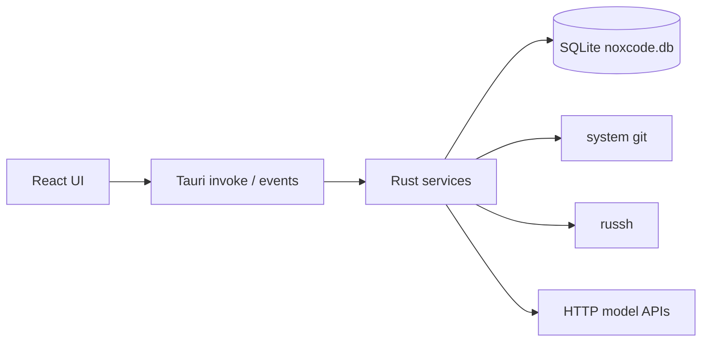

# 架构

noxcode 是 Tauri 2 桌面应用：进程内 Native Agent、AI 渠道、SSH 工作区、Git checkpoint。业务外壳只保留工作区 + 渠道/模型选择 + 会话，不做项目 / 员工 / 看板 / 任务自动化。

完整分阶段计划见 [`plan.md`](../plan.md)。表结构、迁移与备份见 [`database.md`](database.md)。SSH 实现见 [`ssh.md`](ssh.md)。Git 实现见 [`git.md`](git.md)。AI 渠道见 [`channels.md`](channels.md)。Native Agent 运行时见 [`native.md`](native.md)。前端结构见 [`frontend.md`](frontend.md)。打包与发版见 [`release.md`](release.md)。

## 数据流

```
React (UI) → Tauri IPC commands → Rust service layer → SQLite
```

前端永不直接读写 SQLite。`src/lib/database.ts` 是 hard-fail stub（`select` / `execute` / `getDb` 直接抛错）。`src-tauri/capabilities/default.json` 不授予任何 `sql:*` 权限（`sql:default` 含 `allow-select`，因此也不能给）。Zustand 只缓存从 Rust 取回的状态。



## 技术栈

| 层 | 选型 |
| --- | --- |
| 前端 | React 19 + TypeScript 5.8 + Vite 7（端口 1420）+ TailwindCSS 4 + zustand 5 |
| 桌面壳 | Tauri 2.11.5，`identifier=com.wenyuan.noxcode` |
| 后端 | Rust 2021 + Tokio + SQLx 0.8.6（sqlite）+ reqwest 0.12（rustls）+ keyring 3 |
| 插件 | sql / shell / dialog / opener / notification / process / updater |
| SSH | `russh` 0.63，`default-features = false`，features `ring,flate2,rsa`；`ssh2-config` 0.8 |
| Git | 无 git 库，直接 spawn 系统 `git` ≥ 2.23 |

`cargo tree -i aws-lc-rs` 必须无匹配。updater 会再拉一份 reqwest 0.13，与业务 0.12 共存。

运行时外部依赖只有系统 `git`。本地与 SSH 远端都不要求 Node。

## 当前落地 vs 目标分层

入口：[`src-tauri/src/lib.rs`](../src-tauri/src/lib.rs) 注册插件、迁移、命令，启动前跑 git 预检。

| 层 | 现状 | 目标 |
| --- | --- | --- |
| 前端 `src/` | P5 单主界面 + 全屏设置 + Git 抽屉 + API 日志，见 [`frontend.md`](frontend.md) | 保持；斜杠命令完整版 / Markdown 富渲染留 backlog |
| `db/` | version 9（12 张业务表；version 6 增 `ssh_configs.algorithms_json`，version 7 增 `activity_logs`，version 8 增 `native_tool_artifacts` 与 call log / 渠道新列，version 9 增 `native_automations` / `native_goals`，已去掉 `agent_profiles`） | 只追加连续迁移 `10..N` |
| `app/database` + `app/shared` | 健康检查 / 备份 / 恢复 | 保持 |
| `app/activity_logs` + `app/notifications` | checkpoint 活动审计 + 主窗口失焦桌面通知 | 保持 |
| `app/ssh/` + `app/secret_store` | P2 + P5 设置页 / 信任对话框 / 高级算法，见 [`ssh.md`](ssh.md) | 保持 |
| `app/workspaces` | CRUD + 健康检查 + scratch 工作区 | 保持 |
| `app/sessions` | 历史列表 / 续聊判定 / 删会话清 checkpoint | 保持 |
| `git/` | P2.5 + P4.4 可配置自动打点 / 保留清理 + P5 Git 抽屉 / 恢复审计 + 分支切换 | 保持 |
| `engine/` | `ExecutionContext`（local \| ssh） | 继续用 |
| `native/` | P4 运行时 + P5 会话流 / 设置页 + MCP 工作区作用域 | 保持 |

策略是「保留内核 + 替换外壳」：`native/model`、`native/tools`、`native/agent` 从参考实现近乎原样搬运；`native/session.rs` / `manager.rs` 重写（按渠道 + 模型启动，去掉档案 / task / run_queue / 任务自动化）；SSH 与 Git 按本仓库决策新写，不搬系统 `ssh` 子进程和 Node git bridge。

## 启动与 IPC

1. `git::preflight::run_startup_check()`：解析 `git --version`，低于 2.23 或找不到则记失败原因。
2. 注册 sql（preload `sqlite:noxcode.db` + 迁移）、shell、dialog、notification、opener、updater、process。
3. `setup` 创建托盘、从 `$APPCONFIG/window-state.json` 恢复主窗口尺寸。
4. debug 下异步打印迁移状态。
5. `RunEvent::Ready` 时若预检失败，弹中文错误对话框后 `exit(1)`。预检必须等事件循环就绪再弹窗，不能在 `setup` 里阻塞主线程。
6. 关闭主窗口写入窗口尺寸并隐藏到托盘。macOS `RunEvent::Reopen`（点 Dock）恢复主窗口。`RunEvent::Exit` 取消 Agent 并关闭 SshPool。

全仓库只允许 [`src-tauri/src/git/runner.rs`](../src-tauri/src/git/runner.rs) spawn `git`。Windows 子进程走 [`process_spawn.rs`](../src-tauri/src/process_spawn.rs)（隐藏 CMD 窗口）。

前端 invoke 的唯一出口是 [`src/lib/backend.ts`](../src/lib/backend.ts)。已注册命令：

| 命令 | 模块 |
| --- | --- |
| `list_activity_logs` | `app::activity_logs` |
| `health_check` / `backup_database` / `restore_database` / `open_database_folder` | `app::database` |
| `list_ssh_configs` / `get_ssh_config` / `create_ssh_config` / `update_ssh_config` / `delete_ssh_config` | `app::ssh` |
| `probe_ssh_password_auth` / `test_ssh_connection` | `app::ssh` |
| `list_ssh_config_file_hosts` / `import_ssh_config_file_host` | `app::ssh` |
| `resolve_ssh_host_trust` | `app::ssh`（`ask` 模式确认回传） |
| `list_ssh_supported_algorithms` | `app::ssh::algorithms` |
| `get_git_repo_info` / `get_git_status` / `get_git_file_diff` / `get_git_numstat` | `git` |
| `stage_git_paths` / `unstage_git_paths` / `restore_git_paths` | `git` |
| `commit_git_changes` / `push_git_branch` / `list_git_branches` / `create_git_branch` / `checkout_git_branch` / `list_git_files` | `git` |
| `create_git_checkpoint` / `list_git_checkpoints` / `preview_git_checkpoint_restore` / `restore_git_checkpoint` / `clear_git_checkpoints` | `git` |
| `get_quick_prompts` / `update_quick_prompts` | `app::quick_prompts` |
| `list_ai_channels` / `create_ai_channel` / `update_ai_channel` / `delete_ai_channel` | `native::channels` |
| `test_ai_channel` / `list_ai_channel_models` | `native::channels` |
| `list_model_catalog` | `native::model_catalog` |
| `get_network_settings` / `update_network_settings` | `app::network_settings` |
| `list/create/update/delete_workspace` / `check_workspace_health` / `ensure_scratch_workspace` | `app::workspaces` |
| `list_agent_sessions` / `get_agent_session_log_lines` / `prepare_agent_session_resume` / `set_agent_session_pinned` / `delete_agent_session` | `app::sessions` |
| `start/stop/restart/resume_native_session` / `stop_native` / `send/finish_native_input` | `native::session` |
| `resolve_native_tool_permission` / `answer_native_plan_question` | `native::session` |
| `get/update_native_settings` | `native::settings` |
| `list_native_global_skills` / `open_native_skills_dir` | `native::skills` |
| `list/create/update/delete_native_subagent` | `native::subagents` |
| `list/get_native_api_call_log` | `native::api_logs` |
| `get/update/reset_mcp_servers` / `export_mcp_servers_snippet` | `native::mcp_servers` |
| `show_main_window` | `tray` |

事件：`ssh-host-trust-request`、`ssh-host-key-changed`、`native-session`、`native-stdout`、`native-text-delta`、`native-context-usage`、`native-turn-state`、`native-plan-mode`、`native-permission-request`、`native-plan-question`、`native-exit`。Git 细节见 [`git.md`](git.md)。会话细节见 [`native.md`](native.md)。前端接线见 [`frontend.md`](frontend.md)。

## SSH

纯 Rust 协议实现（`russh`），不调系统 `ssh`，不用 `ssh2` C 绑定。细节见 [`ssh.md`](ssh.md)。

- 认证：`key` → `authenticate_publickey`；`password` → `authenticate_password`。密码 / 口令在 keyring（服务名 `noxcode-ssh`）。
- 连接复用：`SshPool` 按 `ssh_config_id` 串行持有一条连接 + keepalive，替代 OpenSSH ControlMaster。
- known_hosts 四态：`accept-new` / `strict` / `ask` / `off`。已知匹配放行；新主机按策略；`KeyChanged` 在前三态一律拒绝并告 MITM。
- `~/.ssh/config` 用 `ssh2-config` 导入 Host 别名。第一版不支持 `ProxyJump`，导入时必须明示，不能静默忽略。
- 配置可持久化 KEX / Host Key / Cipher / MAC 列表；空分类使用 `russh` 默认，未知算法严格拒绝。设置页提供旧服务器预设与恢复默认。
- `exec` 仍经远端 shell，必须保留 `shell_escape_single_quoted`。返回 `SshCommandOutput`，不是 `std::process::Output`。

## Git

对齐直接调系统 git + `GIT_INDEX_FILE` 临时索引 + plumbing checkpoint，不引入 simple-git / Node bridge。

| 规则 | 原因 |
| --- | --- |
| `status --porcelain=v2 --branch -z` | NUL 分隔，文件名含空格 / 中文 / 换行也不拆错 |
| 只读命令加 `--no-optional-locks` | 否则 `git status` 会刷新 `.git/index` 的 stat 缓存 |
| 工具内部写操作用临时索引 | 不能污染用户正在准备的暂存区 |
| 用户在 GitPanel 点暂存 | 写真实 `.git/index`（这是用户意图） |
| checkpoint ref | `refs/noxcode/checkpoints/<session_id>/<seq>`，`git log` / `git branch` 看不见 |

`IndexMode`（ReadOnly / UserIndex / Scratch）是 `git()` 的必填参数。回滚是破坏性操作：前置校验 → 影响面预览 → 自动 pre-restore checkpoint → `restore --worktree` + 可选删除 checkpoint 之后新建的未跟踪文件；同工作区有 `working` 会话时预览 / 回滚都拦截。工具后自动打点可关闭，过期清理默认保留 7 天且只处理已结束会话的 `after_tool_call`，回滚 / 清除写入 `activity_logs`。细节见 [`git.md`](git.md)。

## 模型渠道

渠道配置在表 `ai_channels`（`api_key` 列直接落库）。协议三套：openai chat/completions、anthropic messages、codex Responses。P3 已落地 CRUD、测通、拉模型；细节见 [`channels.md`](channels.md)。

模型目录保持扁平 `model_catalog.json`（`lookup_catalog` 精确 ID / 别名 / 归一化 / 前缀模糊）。完整 `ModelClient`（chat / SSE / 重试 / call log）已在 P4.1 落地，并保留 `ModelClientConfig.network` 与 `build_http_client`。§1 决策 4 的 provider 分层 schema（`noxcode.model-providers.v1` + JSON path 注入思考等级）留到 v2。

HTTP 代理 / 不代理地址 / 自定义 CA 存在 `$APPCONFIG/network-settings.json`，模型请求走 `build_http_client`；本地 Bash / MCP 子进程注入对应代理与 CA 环境，SSH 远端 Bash / MCP 不注入，子 Agent 继承本地 `extra_env`。

## 前端形态（P5）

布局学 ZCode，组件底座用 shadcn / Tailwind。

```
/                      WorkspacePage     左树 + 空态 / 会话流
/settings              SettingsPage      全屏页，左导航三组 + 右卡片
/settings/:section     SettingsPage      深链到分节
/api-logs              ApiCallLogsPage   API 调用记录
```

设置不是 Dialog。SSH 有两个入口：工作区选择器里的「远程连接」，以及设置页集中管理。

## 阶段依赖

```
P0 脚手架 → P1 数据层 → P2 SSH → P2.5 Git → P3 渠道
                                                 ↓
P6 打包  ←  P5 前端  ←  P4.5 ← P4.4 ← P4.3 ← P4.2 ← P4.1
```

P2 必须在 tools/ssh 之前；P3 必须在 model 客户端测通之前；P2.5 必须在 session 接线之前。当前仓库已完成 P0、P1、P2、P2.5、P3、P4、P5、P6。

第一版不做：斜杠命令完整版、插件打包、PTY、内置 ripgrep、浏览器 / CUA、OpenTelemetry。见 `plan.md` §6。
