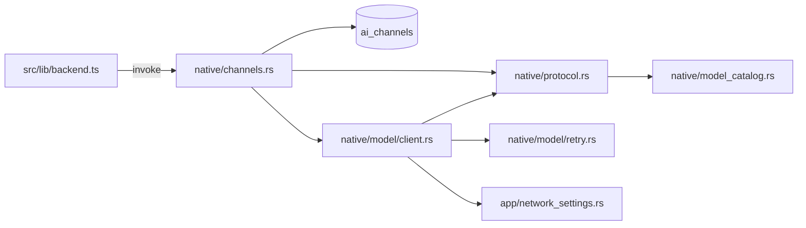

# AI 渠道

P3 落地模型渠道后端：协议归一化、扁平模型目录、渠道 CRUD、测通 / 拉模型，以及 HTTP 代理与自定义 CA。前端只封装 `src/lib/backend.ts` / `src/lib/types.ts` / `src/lib/modelCatalog.ts`，设置页由 `AiChannelsSettingsTab` / `ChannelModelsEditor` 接入。

渠道 API Key 直接落 `ai_channels.api_key` 列，不走 keyring。SSH 密码仍走 `noxcode-ssh`。

## 数据流

```
React (UI) → src/lib/backend.ts → Tauri command
  → native/channels.rs → SQLite ai_channels
  → ModelClient.probe / list_models
  → app/network_settings.rs 构建 reqwest
```



## 源码入口

| 路径 | 职责 |
| --- | --- |
| [`src-tauri/src/native/channels.rs`](../src-tauri/src/native/channels.rs) | 6 个渠道命令、`*_with` 可注入 pool |
| [`src-tauri/src/native/protocol.rs`](../src-tauri/src/native/protocol.rs) | 协议别名、URL、模型 JSON、额外请求头 |
| [`src-tauri/src/native/model_catalog.rs`](../src-tauri/src/native/model_catalog.rs) | 扁平 catalog 查找与 thinking 归一化 |
| [`src-tauri/src/native/model_catalog.json`](../src-tauri/src/native/model_catalog.json) | `include_str!` 内嵌目录 |
| [`src-tauri/src/native/model/client.rs`](../src-tauri/src/native/model/client.rs) | 完整 chat / SSE / 重试 / call log；`probe` / `list_models` 仍给渠道测通 |
| [`src-tauri/src/native/model/retry.rs`](../src-tauri/src/native/model/retry.rs) | 重试判定与错误脱敏 |
| [`src-tauri/src/app/network_settings.rs`](../src-tauri/src/app/network_settings.rs) | `$APPCONFIG/network-settings.json` |
| [`src/lib/backend.ts`](../src/lib/backend.ts) | 前端唯一 invoke 出口 |
| [`src/lib/modelCatalog.ts`](../src/lib/modelCatalog.ts) | 与 catalog 对齐的纯函数 |

## 协议与 URL

`normalize_protocol` 接受别名后落到三套：

| 协议 | 别名 | 对话路径 | 模型列表 |
| --- | --- | --- | --- |
| `openai` | `openai-compatible` / `openai_compatible` | `/v1/chat/completions` | `/v1/models` |
| `anthropic` | `claude` | `/v1/messages` | `/v1/models` |
| `codex` | `responses` / `openai-responses` | `/v1/responses` | `/v1/models` |

Base URL 必须是 `http://` 或 `https://`，末尾 `/` 会去掉后再拼路径。

鉴权：anthropic 用 `x-api-key` + `anthropic-version: 2023-06-01`；其余用 `Authorization: Bearer`。`extra_headers` 禁止覆盖这两个头。

测通（`probe`）发一条非流式 ping：`max_tokens` / `max_output_tokens` = 16，`thinking` 关闭。模型名含 `deepseek` 时 OpenAI 体额外写 `"thinking":{"type":"disabled"}`。2xx 即成功。

拉模型最多 20 页 / 500 条；打满仍有下一页时 `truncated=true`。Anthropic 请求带 `limit=100`，翻页读 `has_more` / `last_id`。

## `models_json` 与思考等级

`ChannelModelConfig`：`id`、`context_tokens`、`max_output_tokens`、`thinking_enabled`、`thinking_level`、`thinking_levels`。

- `thinking_levels` 仅在为 `None` 时采用目录全集（未知模型回退 `low/medium/high`）；用户已保存的显式子集或空数组不会被目录新增等级覆盖。
- 开启思考时拒绝空集合；关闭思考时清空 `thinking_level`。
- 运行时 `thinking_level` 必须属于已选集合，越界回退默认等级（`resolve_runtime_reasoning_effort`）。

删除渠道时若有该渠道的 live session，拒绝删除。历史会话上的 `ai_channel_id` 置空。

## 网络设置

文件：`$APPCONFIG/network-settings.json`。

| 字段 | 含义 |
| --- | --- |
| `http_proxy` | `None` 沿用系统环境变量；有值则只允许 `http://` / `https://` |
| `no_proxy` | 逗号分隔，交给 `reqwest::NoProxy` |
| `ca_cert_path` | PEM 包，可含多张；`add_root_certificate` 追加，不关掉系统根证书 |

命令：`get_network_settings` / `update_network_settings`。渠道测通、拉模型和会话模型请求都走 `build_http_client`。

同一设置还通过 `proxy_env_vars` 转成大小写 HTTP(S) 代理、`NO_PROXY`、`SSL_CERT_FILE` 与 `NODE_EXTRA_CA_CERTS`，注入本地 Bash 和本地 MCP 子进程；子 Agent 继承该环境。SSH 远端 Bash / MCP 不注入本机代理或 CA 环境。

## 前端封装

`listAiChannels` / `createAiChannel` / `updateAiChannel` / `deleteAiChannel` / `testAiChannel` / `listAiChannelModels` / `listModelCatalog` / `getNetworkSettings` / `updateNetworkSettings`。invoke 参数名与 Rust 一致：`payload` 或 `id, updates`。

## P4.1 交接点（已完成）

完整 `native/model/client.rs`（chat / SSE / 重试 / call_log）已覆盖精简版，并保留 `ModelClientConfig.network` 与 `new()` 里的 `build_http_client`。catalog 仍是扁平列表；`noxcode.model-providers.v1` provider 分层与 JSON path 注入思考等级留到 v2。会话接线见 [`native.md`](native.md)。
