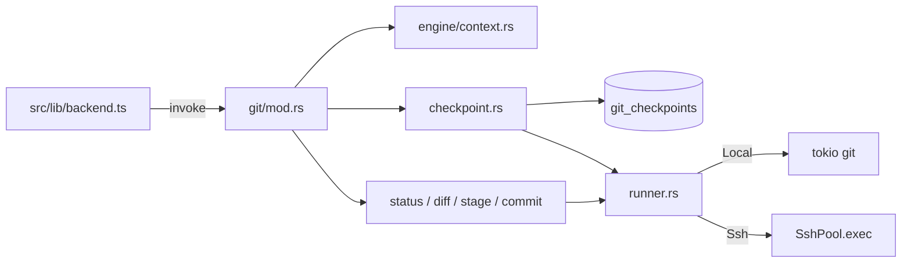

# Git

P2.5 用系统 `git` ≥ 2.23 实现仓库探测、status / diff、用户暂存、提交 / 推送、以及 plumbing checkpoint。不引入 simple-git / Node bridge。前端只封装 `src/lib/backend.ts` / `src/lib/types.ts`。GitPanel / CheckpointTimeline 留给 P5。

全仓库只允许 [`src-tauri/src/git/runner.rs`](../src-tauri/src/git/runner.rs) spawn `git`。

## 数据流

```
React (UI) → src/lib/backend.ts → Tauri command (git/mod.rs)
  → engine/context 解析 workspace
  → status / diff / stage / commit / checkpoint
  → runner.rs
       Local → process_spawn::tokio_command("git")
       Ssh   → SshPool.exec(sh -c bootstrap + git)
```



## 源码入口

| 路径 | 职责 |
| --- | --- |
| [`src-tauri/src/git/mod.rs`](../src-tauri/src/git/mod.rs) | 16 个 Tauri 命令、`workspace_id` → `GitTarget` |
| [`runner.rs`](../src-tauri/src/git/runner.rs) | `GitTarget` / `IndexMode` / `ScratchIndex` / 守卫 / per-repo 锁 |
| [`repo.rs`](../src-tauri/src/git/repo.rs) | rev-parse 四参数、版本、中间态 |
| [`status.rs`](../src-tauri/src/git/status.rs) | `status --porcelain=v2 --branch -z` |
| [`diff.rs`](../src-tauri/src/git/diff.rs) | numstat / name-status / 单文件 diff |
| [`stage.rs`](../src-tauri/src/git/stage.rs) | 用户暂存 / 取消暂存 / 丢弃工作区 |
| [`commit.rs`](../src-tauri/src/git/commit.rs) | commit / push / 分支 |
| [`checkpoint.rs`](../src-tauri/src/git/checkpoint.rs) | 快照、预览、回滚、清扫 |
| [`preflight.rs`](../src-tauri/src/git/preflight.rs) | 启动时本地 git ≥ 2.23 |

## IndexMode 三类

| 模式 | 操作 | 行为 |
| --- | --- | --- |
| `ReadOnly` | status / diff / log / rev-parse / restore --worktree | 自动加 `--no-optional-locks`，禁止写 index |
| `UserIndex` | GitPanel 暂存 / 取消暂存 / commit / switch | 写真实 `.git/index` |
| `Scratch` | checkpoint 的 `add -A` / `write-tree` | `GIT_INDEX_FILE` 临时索引，不碰用户暂存区 |

`UserIndexToken` 只能在 `git/` 内构造。runner 运行期守卫：`ReadOnly` 撞上写 index 子命令直接失败。所有调用注入 `GIT_TERMINAL_PROMPT=0`、`LC_ALL=C`。

B / C 类操作走 per-repo 锁，key 为 `--absolute-git-dir`（SSH 前缀 `ssh:<config_id>:`）。A 类不加锁。

SSH 命令是 `sh -c`（非 login），避免 profile 污染 `-z` 输出。临时索引在远端放 `$HOME/.noxcode/tmp-index/`，显式 `cleanup()`，`Drop` 补发 `rm -f`。

## checkpoint

ref：`refs/noxcode/checkpoints/<session_id>/<seq>`。author / committer 固定 `noxcode <noxcode@local>`。首次打点写入 `log.excludeDecoration=refs/noxcode/`。

创建：复制用户 index → 临时 `add -A` → `write-tree` → `commit-tree` → `update-ref` → 写 `git_checkpoints`。

回滚四步：

1. 前置校验（对象 / ref 一致 / 非 merge 中间态）
2. 影响面：将覆盖 / 将重建 / 不会自动删除的新建文件
3. 自动打 `auto_pre_restore` 检查点，失败则中止
4. `restore --source=<oid> --worktree`（不加 `--staged`，不动 HEAD）；勾选删除时先 `check-ignore --no-index`，gitignore 内永不删

打开工作区（`get_git_repo_info`）时清扫表中不存在的孤儿 ref。会话删除走 `delete_checkpoints_for_session`（P4.4 接线）。

## Tauri 命令

| 命令 | 作用 |
| --- | --- |
| `get_git_repo_info` | 四参数 rev-parse + 分支 / upstream + 远端版本校验 + 孤儿清扫 |
| `get_git_status` | porcelain v2 |
| `get_git_file_diff` | 工作区 / 暂存 / 两个 commit；二进制截掉 base85；超过 2MB 截断 |
| `get_git_numstat` | 工作区 / 暂存 / vs upstream |
| `stage_git_paths` / `unstage_git_paths` | 用户暂存；unborn HEAD 用 `rm --cached` |
| `restore_git_paths` | 丢弃工作区改动 |
| `commit_git_changes` | `commit -m [-- paths]` |
| `push_git_branch` | 含 `--set-upstream`，超时 300s |
| `list_git_branches` / `create_git_branch` | `for-each-ref` / `check-ref-format` + `switch -c` |
| `create_git_checkpoint` / `list_git_checkpoints` | 打点；列表带 `ref_valid` |
| `preview_git_checkpoint_restore` / `restore_git_checkpoint` | 预览 / 回滚 |
| `clear_git_checkpoints` | 清本仓库全部检查点 |

前端对应函数在 `backend.ts`：`getGitRepoInfo`、`getGitStatus`、`getGitFileDiff`、`getGitNumstat`、`stageGitPaths`、`unstageGitPaths`、`restoreGitPaths`、`commitGitChanges`、`pushGitBranch`、`listGitBranches`、`createGitBranch`、`createGitCheckpoint`、`listGitCheckpoints`、`previewGitCheckpointRestore`、`restoreGitCheckpoint`、`clearGitCheckpoints`。

## 测试

`cargo test --manifest-path src-tauri/Cargo.toml`。本地 temp 仓库与进程内 russh `real_shell` 各跑一遍。

覆盖：status / stage / commit / push、index 字节级不变、空格 / 中文 / 换行文件名、rename numstat、回滚三类影响面、gitignore 不删、merge 中间态拒绝、ref 失效、只读部分失败、删会话后 gc 无残留。

## 暂不做

- native 写文件后自动打点（P4.4）
- `ScratchIndex::from_head`（本阶段无 AI 触发的选中路径提交）
- GitPanel / CheckpointTimeline UI（P5）
