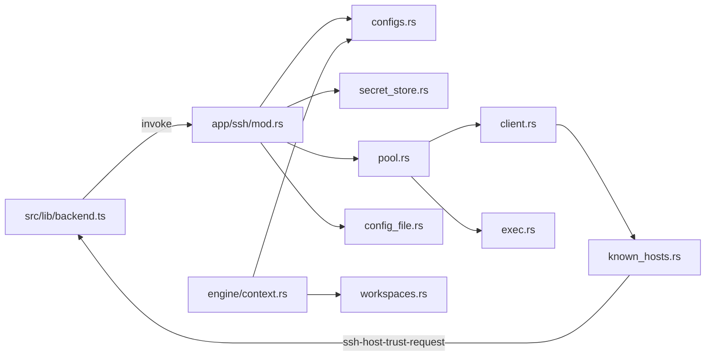

# SSH

P2 用进程内 `russh` 实现 SSH 后端：配置 CRUD、认证、连接池、远端 exec、known_hosts 四态、`~/.ssh/config` 导入、keyring 密钥存储。前端只封装 `src/lib/backend.ts` / `src/lib/types.ts`。设置页与信任横幅留给 P5。

不调系统 `ssh`，不用 `ssh2` C 绑定。`russh` 必须保持 ring 后端：`default-features = false`，features `ring,flate2,rsa`。`cargo tree -i aws-lc-rs` 必须无匹配。

## 数据流

```
React (UI) → src/lib/backend.ts → Tauri command (app/ssh/mod.rs)
  → configs / secret_store / SshPool
  → client.connect + known_hosts
  → exec / SQLite
```



## 源码入口

| 路径 | 职责 |
| --- | --- |
| [`src-tauri/src/app/ssh/mod.rs`](../src-tauri/src/app/ssh/mod.rs) | 10 个 Tauri 命令、`resolve_connect_params`、非 DB DTO |
| [`src-tauri/src/app/ssh/client.rs`](../src-tauri/src/app/ssh/client.rs) | `ConnectParams` / `AuthMaterial` / `connect_and_authenticate` |
| [`src-tauri/src/app/ssh/pool.rs`](../src-tauri/src/app/ssh/pool.rs) | 每配置一条连接、存活校验、空闲回收、`shutdown` |
| [`src-tauri/src/app/ssh/exec.rs`](../src-tauri/src/app/ssh/exec.rs) | `SshCommandOutput`、stdin / 超时 / 断线重试一次 |
| [`src-tauri/src/app/ssh/known_hosts.rs`](../src-tauri/src/app/ssh/known_hosts.rs) | 四态策略、`HostTrustBroker`、算法重排 |
| [`src-tauri/src/app/ssh/configs.rs`](../src-tauri/src/app/ssh/configs.rs) | CRUD / probe / 连通检查的 SQL 与校验 |
| [`src-tauri/src/app/ssh/config_file.rs`](../src-tauri/src/app/ssh/config_file.rs) | 解析 `~/.ssh/config`、列出 Host、导入 |
| [`src-tauri/src/app/ssh/shell.rs`](../src-tauri/src/app/ssh/shell.rs) | 转义、PATH bootstrap、`~` 展开 |
| [`src-tauri/src/app/ssh/error.rs`](../src-tauri/src/app/ssh/error.rs) | `SshError`（中文 Display） |
| [`src-tauri/src/app/secret_store.rs`](../src-tauri/src/app/secret_store.rs) | keyring + `ssh-secret-index.json` |
| [`src-tauri/src/app/workspaces.rs`](../src-tauri/src/app/workspaces.rs) | `fetch_workspace_by_id` |
| [`src-tauri/src/engine/context.rs`](../src-tauri/src/engine/context.rs) | `ExecutionContext`（local / ssh） |
| [`src/lib/backend.ts`](../src/lib/backend.ts) | 前端唯一 invoke / listen 出口 |
| [`src/lib/types.ts`](../src/lib/types.ts) | 与 Rust DTO 对齐的 TypeScript 类型 |

`lib.rs` 在 `setup` 里构造 `SshPool`（空闲 10 分钟、reaper 60s），把 `HostTrustBroker` 事件打到前端；`RunEvent::Exit` 时 `shutdown`。

## 认证与连接

`resolve_connect_params` 从 `SshConfigRecord` 组装 `ConnectParams`：

- `password`：从 keyring 取 `password_ref`。若 `require_password_probe` 且探测状态不是 `passed` / `available`，报「密码认证尚未通过探测，禁止执行远端命令」。
- `key`：必须有 `private_key_path`（展开 `~`）；`passphrase_ref` 若存在则用于 `load_secret_key`。
- 连接超时 15s。keepalive 30s，最多 5 次无响应后视为死连接。
- 已记录在 known_hosts 的算法会排到 `Preferred::DEFAULT.key` 前面，避免 RSA-only 记录被误判成新主机。

返回值是自定义 `SshCommandOutput { stdout, stderr, exit_code }`，不是 `std::process::Output`。后续 `tools/ssh.rs` 用 `.success()`（`exit_code == Some(0)`）。

远端命令走 `sh -lc '<bootstrap><script>'`。bootstrap 只补通用 PATH（`/opt/homebrew/bin`、`/usr/local/bin`、`$HOME/.local/bin`、`$HOME/bin`），不含 Node / nvm / pnpm。

## 连接池

每个 `ssh_config_id` 一把串行锁、最多一条活连接。存活条件：`!is_closed()` 且 `send_keepalive(true)` 成功。fingerprint（不含密文）变化或失活则断开重连。

`channel_open_session` 失败视为 `ConnectionLost`：invalidate 后重试一次。更新 / 删除配置、密码探测、连通测试都会 `invalidate`，避免用到旧会话。

3 次顺序 exec 或 8 路并发 exec 应对同一 TCP 连接（测试用 `connect_count` 与测试服务器 `connections` 双计数断言）。

## known_hosts

默认文件 `~/.ssh/known_hosts`。`known_hosts_mode` 四值：

| 模式 | 未知主机 | 密钥变更（同算法不同 key） |
| --- | --- | --- |
| `accept-new`（默认） | 写入后放行 | 拒绝，发 `ssh-host-key-changed` |
| `strict` | 拒绝 | 同上 |
| `ask` | 发 `ssh-host-trust-request`，等 `resolve_ssh_host_trust`；接受则写入 | 同上 |
| `off` | 跳过校验，不写入 | 跳过 |

主机证书（`Certificate`）直接报「暂不支持主机证书」。`ask` 默认等 120s，超时或拒绝分别是 `TrustPromptTimeout` / `TrustPromptRejected`。

## 密钥存储

密码和私钥口令不进 SQLite。`SecretStore`：

- OS keyring，服务名 `noxcode-ssh`，引用格式 `ssh-secret-{uuid}`
- 应用配置目录下的 `ssh-secret-index.json`（只存 ref 元数据，temp+rename，Unix 0600）
- 删除配置或切换认证类型后 `sweep_orphans`

没有旧版明文 JSON 迁移。备份数据库不会带走 keyring 里的密文。

## `~/.ssh/config` 导入

`ssh2-config` 使用 `ALLOW_UNKNOWN_FIELDS | ALLOW_UNSUPPORTED_FIELDS`。文件不存在返回空列表，不当成错误。

- 列表跳过含 `*` / `?` 以及 negated 的 pattern
- 每个别名 `query(alias)` 合并 `Host *` 默认（具体 Host 写在 `*` 前面才会覆盖默认，与 OpenSSH first-wins 一致）
- 缺 `IdentityFile` 时探测 `~/.ssh/id_ed25519`、`id_ecdsa`、`id_rsa` 第一个存在的文件
- `ProxyJump` 会写入导入结果并标 `proxy_jump_unsupported`，不能静默忽略

## 工作区执行上下文

`resolve_workspace_execution_context(_with_pool)`：

| 工作区类型 | 要求 | `execution_target` |
| --- | --- | --- |
| `local` | `repo_path` 存在且为目录 | `local` |
| `ssh` | 必须有 `ssh_config_id` 与 `remote_repo_path` | `ssh`，label 为 `user@host:port` |

## Tauri 命令

| 命令 | 作用 |
| --- | --- |
| `list_ssh_configs` | 列出配置（无密文） |
| `get_ssh_config` | 按 id 取一条 |
| `create_ssh_config` | 创建；密码 / 口令写入 keyring |
| `update_ssh_config` | 更新后 `pool.invalidate`；改 host/port/user/auth/password 会重置探测字段 |
| `delete_ssh_config` | 仍被 `workspaces.ssh_config_id` 引用则报「当前 SSH 配置仍被工作区引用，不能删除」 |
| `probe_ssh_password_auth` | 仅 password 类型；远端 `printf 'noxcode-password-probe' >/dev/null`；写 `password_probe_*` 为 `passed` / `failed` |
| `test_ssh_connection` | 强制新连接；远端 `echo ok && uname -a && pwd && (git --version 2>/dev/null \|\| echo 'git: not found')`；写 `last_check_*` |
| `list_ssh_config_file_hosts` | 列出 `~/.ssh/config` 中的具体 Host |
| `import_ssh_config_file_host` | 按别名合并导入预填 |
| `resolve_ssh_host_trust` | `ask` 模式确认回传 |

前端对应函数在 `backend.ts`：`listSshConfigs`、`getSshConfig`、`createSshConfig`、`updateSshConfig`、`deleteSshConfig`、`probeSshPasswordAuth`、`testSshConnection`、`listSshConfigFileHosts`、`importSshConfigFileHost`、`resolveSshHostTrust`。

## 事件

| 事件 | payload | 监听 |
| --- | --- | --- |
| `ssh-host-trust-request` | `SshHostTrustPrompt`（`prompt_id`、主机、指纹、known_hosts 路径） | `onSshHostTrustRequest` |
| `ssh-host-key-changed` | `SshHostKeyChanged`（另含 `line`） | `onSshHostKeyChanged` |

P5 再用这两个事件做确认 UI。现在前端只提供 listen 封装。

## 测试

`cargo test --manifest-path src-tauri/Cargo.toml`，不依赖本机 sshd。

| 范围 | 覆盖 |
| --- | --- |
| `shell.rs` | 引号转义、`~` / `$HOME`、redact、`sh -lc` bootstrap |
| `known_hosts.rs` | 三态、四策略、Ask 接受/拒绝/超时、算法重排 |
| `config_file.rs` | 跳过通配符、合并默认、ProxyJump 标记 |
| `secret_store.rs` | roundtrip / 替换 / 清扫 / 索引损坏 |
| `configs.rs` | 内存 SQLite + `SecretStore::in_memory` 的 CRUD 与引用拒删 |
| `context.rs` | local 路径校验、ssh 缺 `remote_repo_path`、label |
| `integration.rs` | 进程内 russh 服务器：密码/公钥（含加密私钥）、exec、stdin、超时、连接池复用与重连、known_hosts 端到端 |

真机 smoke（默认跳过）：

```bash
NOXCODE_SSH_TEST_HOST=... \
NOXCODE_SSH_TEST_USER=... \
NOXCODE_SSH_TEST_KEY_PATH=... \
cargo test --manifest-path src-tauri/Cargo.toml --lib real_server_smoke -- --ignored --nocapture
```

也可用 `NOXCODE_SSH_TEST_PASSWORD` 代替密钥。`NOXCODE_SSH_TEST_PORT` 默认 22。

## 暂不做

记入 backlog，实现时不得静默忽略：

- ssh-agent（`authenticate_publickey_with` + `AgentClient`）
- ProxyJump 跳板（导入已标不支持）
- PTY / 交互 shell
- 主机证书
- known_hosts 通配符 / `@cert-authority` 行（russh 不支持）
